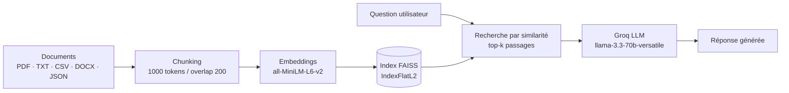

# Assistant de lecture d'articles scientifiques (RAG)

Pipeline RAG (Retrieval-Augmented Generation) qui permet de poser des questions en langage naturel sur un corpus de documents (PDF, TXT, CSV, Excel, Word, JSON) et d'obtenir une réponse générée à partir des passages les plus pertinents — au lieu de laisser un LLM répondre "à l'aveugle" sur un sujet qu'il n'a jamais vu.

## Pourquoi ce projet

Interroger un LLM directement sur un document long (article scientifique, rapport, cours) produit des réponses génériques ou des hallucinations dès que le contenu sort des données d'entraînement du modèle. Ce projet construit le pipeline complet — indexation, recherche vectorielle, génération — pour ancrer les réponses dans le texte source réel.

## Démo

> Capture d'écran / GIF à ajouter ici (ex. `docs/demo.png`) — appel `POST /call_llm/` avec une question et la réponse générée.

## Architecture



| Étape | Détail |
|---|---|
| **Chargement** | `src/data_loader.py` — PDF, TXT, CSV, Excel, Word, JSON via LangChain community loaders |
| **Chunking** | `RecursiveCharacterTextSplitter` — 1000 tokens, 200 tokens de chevauchement |
| **Embeddings** | `sentence-transformers` (`all-MiniLM-L6-v2`) |
| **Stockage vectoriel** | FAISS (`IndexFlatL2`), persistance sur disque ; support ChromaDB en alternative |
| **Génération** | Groq API, `llama-3.3-70b-versatile`, réponse citant les passages utilisés |
| **Interface** | API REST FastAPI (`main.py`) — endpoint `POST /call_llm/`, renvoie la réponse **et** ses sources (fichier + page) |

## Installation

```powershell
python -m venv env
.\env\Scripts\activate
pip install --upgrade pip
pip install -r requirements.txt
```

Créer un fichier `.env` à la racine avec votre clé Groq :
```env
GROQ_API_KEY=votre_cle_groq
```

## Utilisation

Placer vos documents dans `data/`, puis :

```powershell
# Indexation + recherche en local
python app.py

# Ou lancer l'API
fastapi dev main.py
```

```python
import requests

response = requests.post(
    "http://localhost:8000/call_llm/",
    json={"query": "What is attention mechanism?", "top_k": 3}
).json()

print("Réponse :", response["summary"])
for s in response["sources"]:
    print(f"  source : {s['source']}, page {s['page']}")
```

Chaque réponse est accompagnée de la liste des passages utilisés (`sources`) — fichier source, numéro de page et extrait — pour pouvoir vérifier d'où vient l'information plutôt que de faire confiance au résumé les yeux fermés.

Documentation interactive : `http://localhost:8000/docs`

## Limites actuelles

- Pas de jeu d'évaluation formel (pas de mesure de pertinence du retrieval type recall@k ou de qualité de génération) — le projet fonctionne mais n'est pas encore mesuré.
- Un seul backend LLM (Groq) ; le changement de modèle nécessite d'éditer `src/search.py`.
- La citation de page ne fonctionne que pour les PDF (métadonnée `page` fournie par `PyPDFLoader`) ; les autres formats (TXT, CSV, DOCX, JSON) n'exposent que le nom du fichier source.

## Ce que j'ai appris

- Le compromis taille de chunk / chevauchement a un impact direct sur la pertinence du retrieval : trop petit, on perd le contexte ; trop grand, on dilue la similarité vectorielle.
- Séparer la logique métier (`src/`) de l'exposition API (`main.py`/`app.py`) permet de tester le pipeline RAG en CLI avant de l'exposer en REST — utile pour déboguer sans dépendre du serveur.
- FAISS suffit largement pour un corpus de taille modeste et évite la complexité opérationnelle d'une base vectorielle managée pendant la phase de prototypage.

## Prochaines étapes

- [ ] Ajouter un jeu de questions/réponses de référence pour mesurer la qualité du retrieval
- [ ] Dockeriser l'API pour un déploiement reproductible

## Stack

Python · FastAPI · LangChain · FAISS · Sentence-Transformers · Groq API (Llama 3.3)
